# CaskTown (木桶镇)

## 项目愿景

CaskTown（木桶镇）是一款基于 Web 的 JRPG 游戏，以中国神话与暗黑奇幻为背景。玩家扮演被囚于木桶中的主角，在废墟小镇中探索、战斗、结交伙伴，逐步揭开预言的真相并重建家园。游戏包含分支剧情、多结局、回合制战斗、地图探索、城镇重建等核心系统。

## 架构总览

- **运行时**: 浏览器端，基于 Phaser 4.1 游戏引擎 + Vite 8 构建
- **语言**: TypeScript (strict mode)，运行时 Bun
- **架构模式**: 单体应用，按职责分层（scenes / core / data / utils / editor）
- **状态管理**: 单例 `GameData` 管理全局游戏状态，`EventBus` 事件驱动通信
- **数据层**: 静态 TypeScript 数据表（无数据库），`GameConfigDatabase` 支持运行时覆盖与持久化
- **构建产物**: 两个入口 -- 游戏 (`index.html`) 和配置编辑器 (`editor.html`)

## 模块结构图

```mermaid
graph TD
    A["(根) CaskTown"] --> B["src"]
    A --> C["scripts"]
    A --> D["assets"]
    A --> E["img"]
    A --> F["doc"]
    A --> T["tests"]

    B --> G["scenes"]
    B --> H["core"]
    B --> I["data"]
    B --> J["utils"]
    B --> K["editor"]

    C --> C1["精灵工具链"]
    C --> C2["语音工具链"]
    C --> C3["图标生成"]

    D --> D1["audio/bgm (19)"]
    D --> D2["audio/voice (835+)"]
    D --> D3["sprites (371 PNG)"]

    E --> E1["desiges (8 设计稿)"]
    E --> E2["sprites (8 图集)"]

    F --> F1["GDD v2"]
    F --> F2["完整剧情脚本"]

    T --> T1["core (7)"]
    T --> T2["data (3)"]
    T --> T3["utils (2)"]

    click G "./src/scenes/CLAUDE.md" "scenes"
    click H "./src/core/CLAUDE.md" "core"
    click I "./src/data/CLAUDE.md" "data"
    click J "./src/utils/CLAUDE.md" "utils"
    click K "./src/editor/CLAUDE.md" "editor"
    click C "./scripts/CLAUDE.md" "scripts"
    click D "./assets/CLAUDE.md" "assets"
    click E "./img/CLAUDE.md" "img"
    click F "./doc/CLAUDE.md" "doc"
```



## 模块索引

| 模块路径 | 职责 | 文件数 | CLAUDE.md |
|---------|------|--------|-----------|
| `src/scenes` | 13 个 Phaser 场景 | 13 | [有](./src/scenes/CLAUDE.md) |
| `src/core` | 12 个核心系统 | 12 | [有](./src/core/CLAUDE.md) |
| `src/data` | 15 张数据表 + 类型 + 配置数据库 | 16 | [有](./src/data/CLAUDE.md) |
| `src/utils` | 全局常量(130+)、触控、生命周期、语音 | 4 | [有](./src/utils/CLAUDE.md) |
| `src/editor` | Web 配置编辑器 | 2 | [有](./src/editor/CLAUDE.md) |
| `scripts` | 7 个构建/工具脚本 | 7 | [有](./scripts/CLAUDE.md) |
| `assets` | 1225+ 个资源文件 (BGM/语音/精灵) | 1225+ | [有](./assets/CLAUDE.md) |
| `img` | 8 设计稿 + 8 精灵图集 | 25 | [有](./img/CLAUDE.md) |
| `doc` | GDD + 完整剧情脚本 | 2 | [有](./doc/CLAUDE.md) |
| `tests` | 12 个测试文件 (core/data/utils) | 12 | - |

## 世界架构概览

### 地图与流程 (27 张地图)

```
木桶镇 (起点)
|-- MAP_001 荒芜 / MAP_002 重建
|
|--[东]-> 奇妙森林 (MAP_010-012)
|         |-- 白虎战 / 千年树种
|
|--[码头]-> 圣水殿 (MAP_020->030->031)
|           |-- 熙苑问答
|
|--[山路]-> 神殿 (MAP_040->041->042)
|          |-- 凤凰麒麟 / 月桂
|
|--[北]-> 生命之泉 (MAP_050)
|        |-- 青龙潭 (MAP_051)
|        |-- 白虎穴 (MAP_052)
|        |-- 朱雀林 (MAP_053)
|        |-- 玄武殿 (MAP_054)
|        |-- 轮回道 (MAP_055) [需四封印]
|
|--[北]-> 魔宫 (MAP_060->061->062->063)
|         |-- xiaoai 净化
|
|--[北]-> 人心之渊 (MAP_070)
          |-- 无相最终战
```

### 对话系统规模

- 259+ 个对话条目 (DIALOGUES) + 38 个别名扩展 = ~297 个有效对话节点
- 36 个角色，35 个分支点，约 110 个选择项
- 对话完成动作 (`onComplete`) 支持对话结束自动触发事件链
- 42 场战斗触发对话，5 个商店入口，10+ 技能解锁事件

### 战斗与进度

- 13 场 Boss 战（含最终 Boss 无相）
- 17 个宝箱分布
- 5 级城镇重建（荒芜->心安）
- 双结局：普通结局 + 真结局（需慈悲值>=3 + 记忆碎片>=3）
- 主角初始装备：父亲之剑 + 父亲之甲 + 预言之书

## 运行与开发

```bash
bun install           # 安装依赖
bun run dev           # 开发服务器 (端口 5173)
bun run build         # 类型检查 + 构建
bun run preview       # 预览构建产物
bun test              # 运行测试

# 精灵工具链
bun run sprites:repair    # 修复精灵图集
bun run sprites:refresh   # 生成图标 + 修复 + 刷新

# 语音工具链
bun run voices:sync       # 同步语音线路
bun run voices:generate   # 生成语音文件
```

### 路径别名

- `@/*` -> `./src/*`
- `@assets/*` -> `./assets/*`

### 快捷键

- **F5**: 快速存档
- **F9**: 快速读档

## 测试策略

- 测试框架: Bun 内置测试 (`bun test`)
- 当前测试文件: **12 个**（新增）

| 目录 | 文件 | 覆盖模块 |
|------|------|----------|
| `tests/core` | `game-data.test.ts` | GameData (重置/序列化/真结局/装备/经验) |
| `tests/core` | `event-bus.test.ts` | EventBus (注册/触发/移除/上下文) |
| `tests/core` | `quest-system.test.ts` | QuestSystem (开始/推进/完成) |
| `tests/core` | `barrel-system.test.ts` | BarrelSystem (解锁/能力/战斗使用) |
| `tests/core` | `save-manager.test.ts` | SaveManager (存档/读档/槽位) |
| `tests/core` | `skill-growth.test.ts` | SkillGrowth (解锁条件/防重复) |
| `tests/core` | `map-access.test.ts` | MapAccess (访问限制/数值阈值) |
| `tests/data` | `config-database.test.ts` | GameConfigDatabase (CRUD/持久化/克隆) |
| `tests/data` | `data-integrity.test.ts` | 数据完整性 (字段校验/引用校验) |
| `tests/data` | `game-content.test.ts` | 游戏内容 (地图几何/对话引用/ID一致性) |
| `tests/utils` | `constants.test.ts` | 常量一致性 (分辨率/阈值/元素相克) |
| `tests/utils` | `voice-lines.test.ts` | 语音线路解析 (键生成/路径构造) |

## 编码规范

- TypeScript strict mode，启用 `noUncheckedIndexedAccess`、`noImplicitOverride`、`noFallthroughCasesInSwitch`
- 模块系统: ESNext + `verbatimModuleSyntax`
- 目标: ES2020
- 像素艺术渲染: `pixelArt: true`，`roundPixels: true`
- 游戏分辨率: 1920x1080 (基础 960x540 * 2x 缩放)
- 常量集中管理: `src/utils/constants.ts` (130 顶级导出，~1256 个常量)，禁止魔法数字
- UI 字体: 中文优先字体栈（PingFang SC / Microsoft YaHei / Noto Sans CJK SC）
- 路径分隔符: 代码中使用 POSIX 风格 (`/`)
- 精灵资源: 通过图集打包，`img/sprites/pack_manifest.json` 管理清单

## AI 使用指引

- 游戏引擎为 Phaser 4.1（非 Phaser 3），API 有差异，查文档时注意版本
- 修改数据表时，优先通过 `GameConfigDatabase` 的 API，而非直接修改 `src/data/` 下的静态数据
- 场景间通信通过 `EventBus`，不要跨场景直接引用
- 全局状态由 `GameData` 单例管理，通过 `GameData.getInstance()` 获取
- 对话脚本 (`DialogueScript`) 定义在 `src/scenes/DialogueOverlay.ts` 中，支持 `onComplete` 完成动作链
- 精灵资源流程：修改 `img/sprites/` 源文件 -> `repair` -> `refresh` -> 产物到 `assets/sprites/`
- 语音流程：修改 `dialogues.ts` -> `sync` -> `generate` -> 产物到 `assets/audio/voice/`
- 编辑器入口独立于游戏入口，位于 `editor.html`，使用 Vite 插件提供 API
- `constants.ts` 中 `MAP_HUD.EVENT_COLORS` 与 `CONFIG_EDITOR_EVENT_COLORS` 存在重复定义（格式不同：数值 vs 字符串），修改时需同步更新
- `GameData.playTime` 通过 `syncPlayTime()` 在序列化时自动同步，`SaveManager` 负责持久化到 `SaveMeta.playTime`

## 变更记录

| 时间 | 操作 | 说明 |
|------|------|------|
| 2026-05-22 14:10:48 | 新建 | 初始化架构文档 |
| 2026-05-22 | 深度扫描 | 补充世界架构、对话规模、常量审计、资产清单、脚本流水线 |
| 2026-05-22 15:52:17 | 增量更新 | 新增测试策略(12个测试文件)、GameEvents扩展至18事件、DialogueScript.onComplete、playTime同步、初始装备、模块索引修正(editor=2文件)、Mermaid图增加tests节点 |
