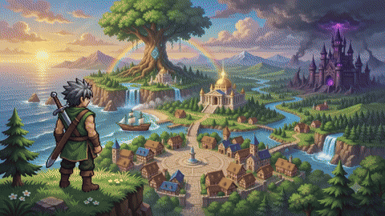
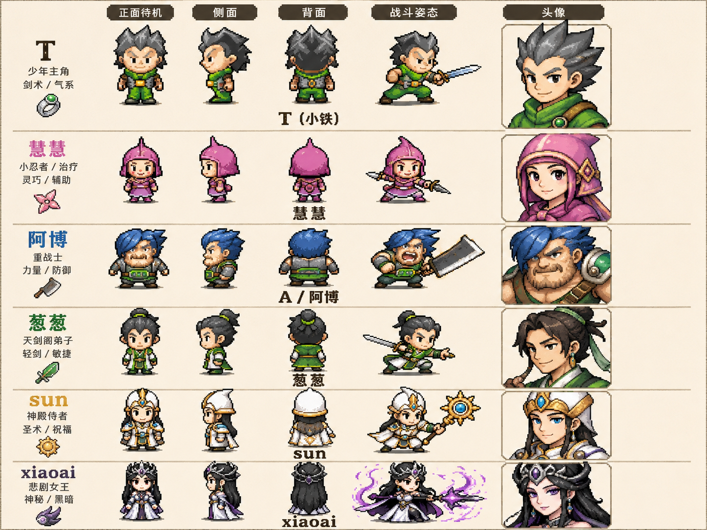
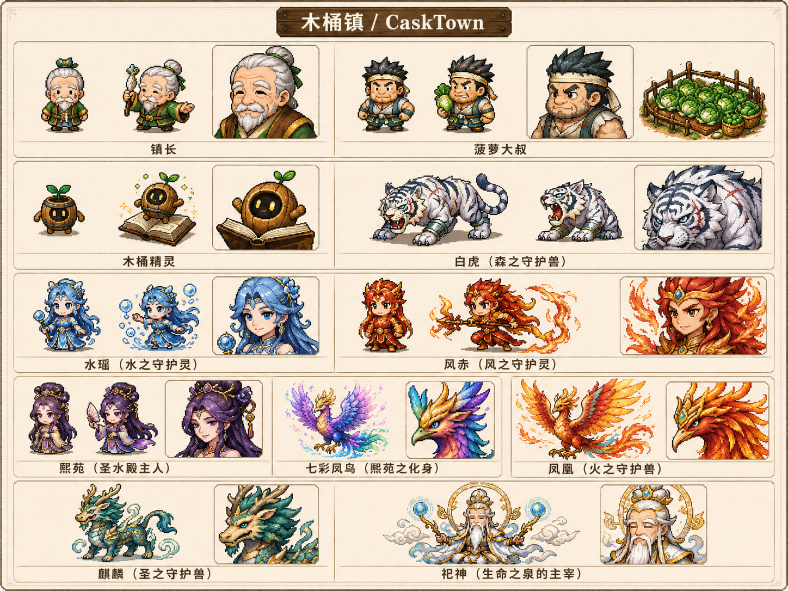
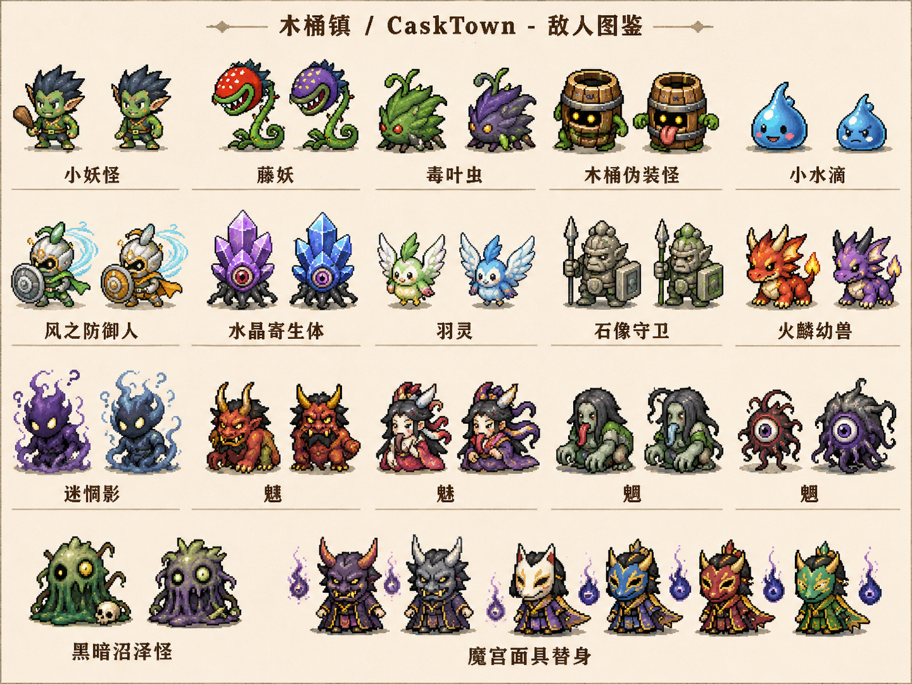
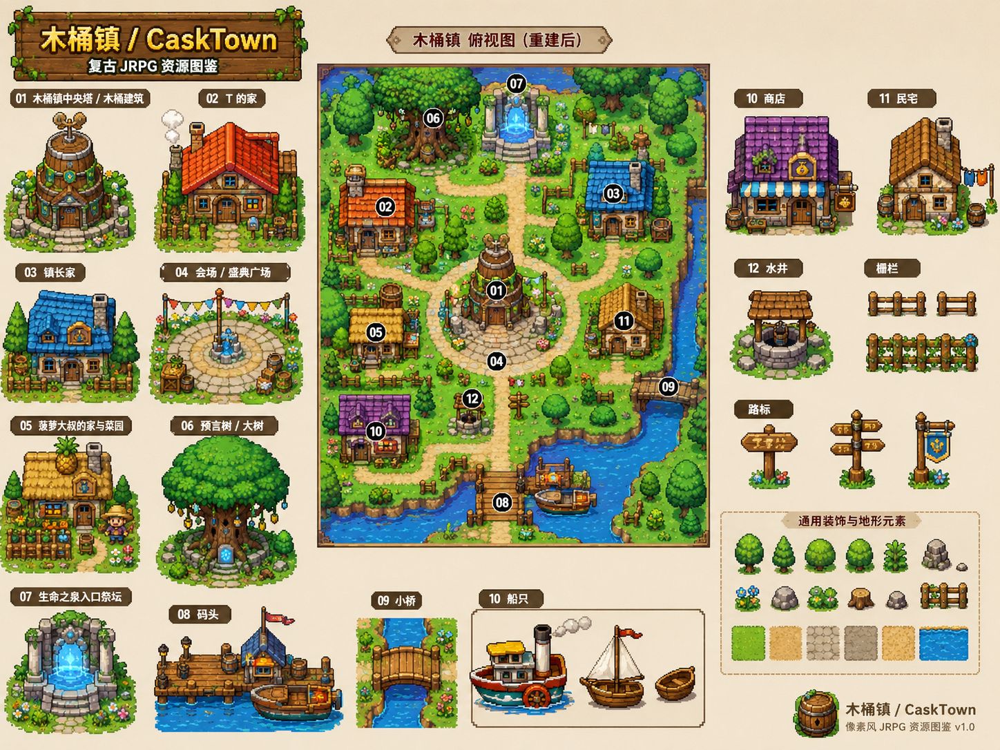
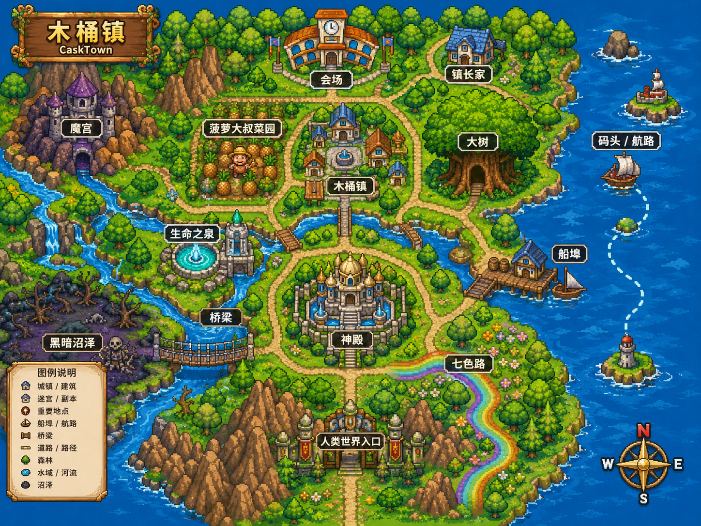
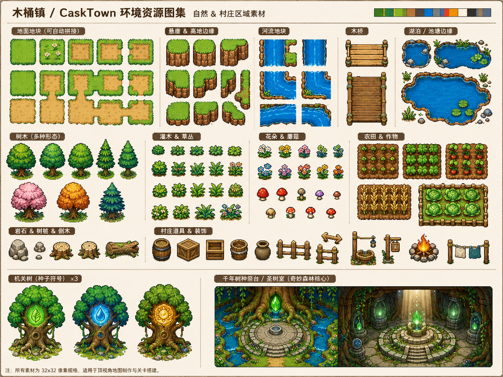
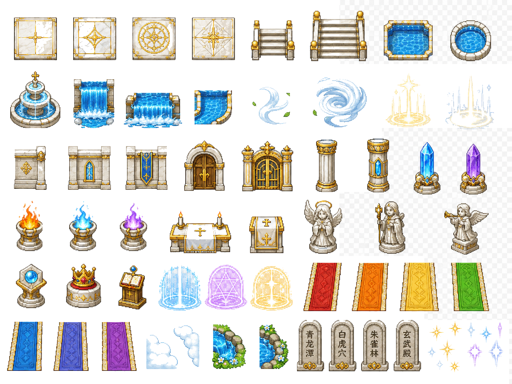
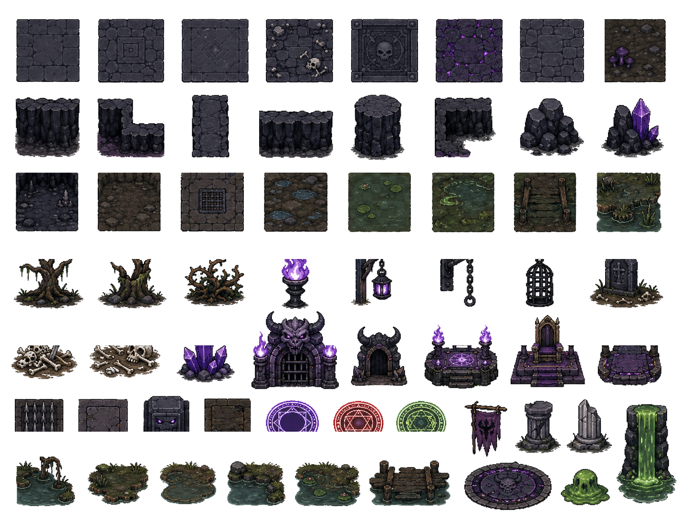

# 木桶镇 / CaskTown

《木桶镇 / CaskTown》是一个面向浏览器的 2D 顶视角剧情 JRPG。玩家扮演少年 T，与慧慧、A、葱葱、sun 等伙伴从被魔头侵袭的木桶镇出发，寻找三件神物重建家园，进入生命之泉追索 xiaoai 堕魔真相，并在童话外壳与悲悯内核交织的冒险中面对人心深处的黑暗。

项目当前使用 Phaser 4.1.0、TypeScript、Vite 和 Bun，资源由 Vite 的 `assets` 公共目录提供。

## 在线体验

- Github: [https://cyber-tao.github.io/casktown](https://cyber-tao.github.io/casktown)
- Vercel: [https://casktown.vercel.app](https://casktown.vercel.app)
- Cloudflare: [https://casktown.pages.dev](https://casktown.pages.dev)

## 游戏预告

<a href="assets/trailer.mp4">
  
</a>

[观看高清 MP4 预告片](assets/trailer.mp4)

## 项目起源

《木桶镇 / CaskTown》的灵感来自 Hoker.JT 学生时代参加“火客论坛”（Hoker）时，一群朋友共同产生的游戏想法。游戏里的角色都来自当时论坛里的朋友，那些昵称、性格和彼此之间的玩笑，构成了最早版本的角色关系与冒险气质。

最开始的游戏项目并不是 Hoker.JT 开发的，而是论坛里的其他朋友在 DOS 环境下使用 QUICKBASIC 编写的。当前仓库是 Hoker.JT 开发的网页重制版本，让这个学生时代的作品更容易被分享、打开和游玩，也让旧日设想能够以更完整的剧情、系统和美术资源重新呈现。

## 游戏介绍

游戏采用传统 JRPG 的探索、对话、战斗和成长结构，并针对网页游玩节奏做了轻量化处理。核心体验包括：

- 剧情探索：顶视角地图移动、调查、NPC 对话和事件触发。
- 回合制战斗：角色技能、消耗管理、敌人机制和 Boss 战推进剧情。
- 家园重建：通过主线神物和支线资源让木桶镇从荒芜逐步恢复。
- 预言之书：整合任务日志、地图线索、怪物图鉴、剧情回顾和分支记录。

## 世界与设定

木桶镇是故事的中心。盛典之日后，镇子遭遇灾难，T 和伙伴们踏上寻找神物、修复家园的旅程。世界从明亮的童话村镇展开，逐步连接奇妙森林、圣水殿、七色路、神殿、生命之泉和魔宫等区域。

故事表层保留轻松、可爱和带有论坛朋友气质的对白节奏，底层则围绕家园毁灭、守护兽牺牲、警世者堕落与人心黑暗展开。重建木桶镇、理解 xiaoai 的过去、释放生命之泉的封印，以及最终是否走向真结局，都会受到玩家在剧情与战斗中的选择影响。

## 快速开始

```bash
bun install
```

```bash
bun run dev
```

开发服务器默认运行在 `http://localhost:5173`。

## 可用命令

| 命令 | 说明 |
| --- | --- |
| `bun run dev` | 启动 Vite 开发服务器 |
| `bun run build` | 执行 TypeScript 类型检查并构建到 `dist` |
| `bun run preview` | 预览生产构建结果 |
| `bun run sprites:refresh` | 根据 `img/sprites` 的图集与 JSON 元数据切分刷新 `assets/sprites` |

## 技术栈

| 类型 | 使用内容 |
| --- | --- |
| 运行时与包管理 | Bun |
| 游戏引擎 | Phaser 4.1.0 |
| 语言 | TypeScript |
| 构建工具 | Vite |
| 存档 | LocalStorage |

## 项目结构

```text
src/
  core/      全局系统与管理器
  data/      角色、任务、地图、敌人、物品、技能、对话和类型数据
  scenes/    Phaser 场景与 UI Overlay
  utils/     全局常量等工具定义
scripts/     开发时使用的脚本，例如刷新运行时 sprite 资源
assets/
  audio/     BGM、SFX 和语音资源
  sprites/   角色、场景、怪物、NPC、世界物件等图像资源
img/
  desiges/   美术设计参考图和整合预览图，不作为运行时资源直接加载
  sprites/   可切分的 sprite sheet、JSON 元数据和资源清单
doc/         游戏设计、剧情脚本、分支和战斗点文档
```

[img/sprites](img/sprites) 中的 JSON 采用类似 TexturePacker 的 `frames + meta` 结构，可用于按像素坐标切分图集；实际游戏加载使用 [assets/sprites](assets/sprites) 下的资源。

## 美术设定集

[img/desiges](img/desiges) 收录项目的美术设定集与整合预览图，用于统一角色、敌人、地图和环境美术方向。当前包括主角与伙伴、NPC 与守护者、敌人设计、木桶镇俯视地图、世界地图，以及自然环境、圣殿和暗黑幻想区域的 tiles 参考。

这些图片是开发与重制过程中的设计参考，不会被游戏运行时代码直接加载。运行时可用的切分资源位于 [assets/sprites](assets/sprites)，其来源和切分元数据位于 [img/sprites](img/sprites)。

### 角色、NPC 与敌人

| 主角与伙伴 | NPC 与守护者 | 敌人设计 |
| --- | --- | --- |
|  |  |  |

### 地图与环境

| 木桶镇俯视图 | 世界地图 |
| --- | --- |
|  |  |

| 自然环境 tiles | 圣殿 tiles | 暗黑幻想 tiles |
| --- | --- | --- |
|  |  |  |

## 美术资源流程

1. 根据 [img/desiges](img/desiges) 下的角色、敌人、地图和环境设定集，创建或更新 [img/sprites](img/sprites) 中的图集 PNG 与对应 JSON 文件。
2. 运行 `bun run sprites:refresh`，脚本会读取 [img/sprites/pack_manifest.json](img/sprites/pack_manifest.json)，按 JSON 中的 frame 坐标切分所有图集。
3. 切分结果会刷新到 [assets/sprites](assets/sprites)，供 BootScene 和运行时代码加载。

## 关键文档

- [游戏设计文档](doc/CaskTown_Web_JRPG_GDD_v2.md)：产品定位、系统设计、地图结构、战斗节奏和 UI 目标。
- [剧情与分支文档](doc/CaskTown_Full_Script_Branches_BattlePoints.md)：完整剧情脚本、角色代号、分支变量、真结局条件和战斗触发点。

## 开发提示

- 入口文件是 [src/main.ts](src/main.ts)，Phaser 4 配置在 [src/game.ts](src/game.ts)。
- 启动资源加载集中在 [src/scenes/BootScene.ts](src/scenes/BootScene.ts)。
- 全局游戏状态由 [src/core/GameData.ts](src/core/GameData.ts) 管理。
- 跨场景通信使用 [src/core/EventBus.ts](src/core/EventBus.ts)。
- 新增常量统一放在 [src/utils/constants.ts](src/utils/constants.ts)。
